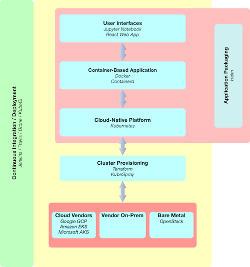
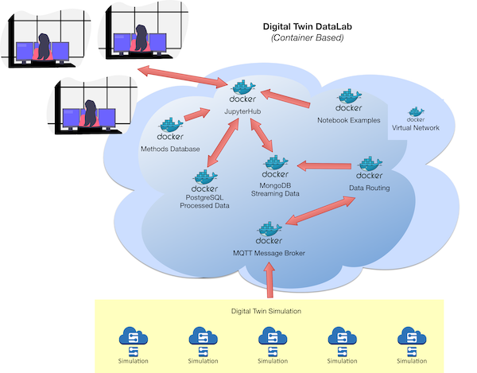

### Developing a *Cloud-Native* DataLab

#### What is a cloud-native application?

The [Cloud Native Computing Foundation (CNCF)](https://www.cncf.io) define cloud native as:

*Cloud native technologies empower organizations to build and run scalable applications in modern, dynamic environments such as public, private, and hybrid clouds. Containers, service meshes, microservices, immutable infrastructure, and declarative APIs exemplify this approach.*

*These techniques enable loosely coupled systems that are resilient, manageable, and observable. Combined with robust automation, they allow engineers to make high-impact changes frequently and predictably with minimal toil.*

*The Cloud Native Computing Foundation seeks to drive adoption of this paradigm by fostering and sustaining an ecosystem of open source, vendor-neutral projects. We democratize state-of-the-art patterns to make these innovations accessible for everyone.*

[Red Hat](https://www.redhat.com/en/resources/cloud-native-container-design-whitepaper) describes cloud native as:

*“Cloud native” is a term used to describe applications designed specifically to run on a cloud-based infrastructure. Typically, cloud-native applications are developed as loosely coupled microservices running in containers managed by platforms. These applications anticipate failure, and they run and scale reliably even when their underlying infrastructure is experiencing outages. To offer such capabilities, cloud-native platforms impose a set of contracts and constraints on the applications running on them. These contracts ensure that the applications conform to certain constraints and allow the platforms to automate the management of the containerized applications.*

In [Cloud Native Paterns](https://www.manning.com/books/cloud-native-patterns), Cornelia Davis defines cloud-native as:

*Cloud-native software is highly distributed, must operate in a constantly changing environment and is itself constantly changing.*

She identifies three key characteristics of cloud-native software:  
  
* *Cloud-Native Apps:* Implement behaviours that allow it to operate in service relationships and support cloud-native operational practices such as scaling and updating;
* *Cloud-Native Data:* Cloud-native software typically uses a microservices architecture and traditional centralised databases are similarly decomposed and distributed;
* *Cloud-Native Interactions:* Due to the replicated and distributed nature of cloud-native software requires routing of requests, automated request retries (with in-built circuit-breakers) and observability of logging across the whole distributed application. 

A cloud-native application is an application that is structured, developed and deployed in such a way that it embodies these characteristics using appropriate technologies and practices.

The cloud-native technology landscape is an emerging and growing area. The Cloud Native Computing Foundation have put together a map of this landscape:

This clearly can be overwhelming, so here we will use a very simple technology stack that will be sufficient for our needs and can be augmented as new requirements arise.

##### A simple technology stack for developing and delivering cloud-native applications:

#### What is a DataLab?

A DataLab brings together data, analytical techniques and computational resources for a specific purpose. This purpose could potentially
cover a wide range of possibilities, e.g. exploratory investigations of datasets, learning about innovative statistical techniques, developing an 
understanding of particular application areas, or integrating different modelling approaches.

The basic premise here is to start with the idea of a (very) simple generic DataLab built as a containerised application and then developed for production as a cloud-native application.

It is hoped that as well as documenting the steps taken I can also reflect on the pros and cons of various decisions en-route.

#### A Generic DataLab

A [Digital Twin](https://en.wikipedia.org/wiki/Digital_twin) DataLab has been chosen because it raises some interesting architectural questions for the system due to the digital twin data integration layer.   

So, what is the purpose of this Digital Twin Datalab? I think just to explore the characteristics of modelled data, historical observations, streaming sensor data and simulation using a variety of techniques. The idea is to describe a generic DataLAb from an architectural perspective that would then be specialised for a specific application domain.

However, a real objective of this work is to document (and reflect upon) the approach used to move from a traditional software architecture to a cloud-native architecture.

#### Microservice Architecture of a (Container-Based) DataLab  
  
  

1. **Virtual Network:** Used for container networking and for simple dns lookup. 
`docker network create -d bridge bridge_network`

2. **Sensor Emulators:** Python scripts publishing to a MQTT message broker.

3. **MQTT Message Broker container:** Used for publish/subscribe to message topics. Image pulled directly from [https://hub.docker.com/_/eclipse-mosquitto]().  

~~~~
docker pull eclipse-mosquitto 
docker run -it --name mosquitto --network=bridge_network -p 1883:1883 -p 9001:9001 eclipse-mosquitto
~~~~ 

4. **Sensor application:** Subscribes to message broker and sends received sensor data to a streaming data database. This would be a convient place for quality control and addition of meta-data if required.   

~~~~
docker build -t sensor_app . 
docker run --network=bridge_network sensor_app
~~~~

5. **Streamed Data Database:** Populated with sensor data as it arrives on the MQTT message bus. The database chosen here is the document-based database MongoDB. Image pulled directly from [https://hub.docker.com/_/mongo]().   

~~~~
docker pull mongo  
docker run --name mongo_db --network=bridge_network -p 27017:27017 -d mongo:latest
~~~~  

6. **Processed Data Database:** Populated with processed data. The database chosen here is the relational database PostgreSQL. Image pulled directly from [https://hub.docker.com/_/postgres]().  

~~~~
docker pull postgres  
docker run --network=bridge_network --name postgres_db -e POSTGRES_PASSWORD=postgres -p 5432:5432 -d postgres
~~~~  

7. **Jupyter Notebook:** The application front-end is based upon the SciPy container published by Jupyter with the addtion of python libraries for the database connections and a simple Jupyter notebook to test database connections. Initial image pulled directly from [https://hub.docker.com/r/jupyter/scipy-notebook]().  

~~~~
Dockerfile: 
FROM jupyter/scipy-notebook:latest 
ADD db.ipynb /home/jovyan
RUN conda install -y pymongo psycopg2 
  
docker build -t jupyter_notebook .    
docker run --name jupyter_notebook --network=bridge_network -p 8888:8888 jupyter_notebook
~~~~    

8. **DataLab Composition:** The DataLab application is composed from these services and uses `docker-compose` to do this composition. The docker-compose file describing the service compostion is [docker-compose.yml](container-based/docker-compose.yml). This approach means all the previous commands for image builds and running of containers can be replaced by:  
`docker-compose up`.  

9. **Sensor Emulation:**  
For example:  
`mosquitto_pub -t sensors -m '{"name": "sensor1", "value": 5.1}'`

If you want to run the container-based system, ensure you have docker installed and then:  

~~~~
git clone https://github.com/digsci/datalabs.git 
cd datalabs/container-based
docker-compose build
docker-compose up
~~~~  
The Jupyter Notebook can be found at `localhost:8888` and the username is 'datalabs' with any password.

To close the system gracefully use:  
`docker-compose down`

#### Cloud-Native Approach 

The container-based application already has some benefits arising from its loosely-coupled microservices architecture (.e.g. ability to have polyglot development approaches, updating of individual services) but it doesn't in itself provide a resilient and scalable application.

We can use a *cloud-native platform* to begin the  process of building an application with resilient and scalable features. The [Kubernetes (K8s)](https://kubernetes.io) platform is described as *"... an open-source system for automating deployment, scaling, and management of containerized applications"*. 

A production-ready k8s cluster would be created using any of the various vendor's offerings or directly on-premise, but here we are using just a local machine at the moment. A local k8s cluster can be created using tools such as [Minikube](https://kubernetes.io/docs/tasks/tools/install-minikube/) or [Docker Desktop](https://www.docker.com/products/docker-desktop).  

Using the K8s system, we can take a declarative approach describing what we would like our system to look like using configuration files that we submit to K8s. There are many different component types in k8s, but initially only *deployment* and *service* are used:
  
1. **[Deployment](https://www.docker.com/products/docker-desktop):** Describe desired state for an application (e.g. number of replicated microservice containers) and update strategies.  
2. **[Service:](https://kubernetes.io/docs/concepts/services-networking/service/)** Provide stable, resilient networking and ip addresses for microservice containers.  

Example Jupyter Notebook deployment file:  
  
~~~~
apiVersion: apps/v1 
kind: Deployment  
metadata: 
    name: jupyter-notebook-deploy  
spec:
    replicas: 3
    selector:
        matchLabels:
            app: jupyter-notebook
    minReadySeconds: 10
    strategy:
        type: RollingUpdate
        rollingUpdate:
            maxUnavailable: 1
            maxSurge: 1
    template:
        metadata:
            labels:
                app: jupyter-notebook
        spec:
            containers:
                - name: jupyter-notebook
                  image: graham/jupyter_notebook:1.0
                  securityContext:
                    runAsUser: 0
                  ports:
                      - containerPort: 8000
~~~~

Example Jupyter Notebook service file:  

~~~~
apiVersion: v1
kind: Service
metadata:
    name: jupyter-notebook
    labels:
        app: jupyer-notebook
spec:
    type: NodePort
    ports:
        - port: 8000
          nodePort: 30001
          protocol: TCP
    selector:
        app: jupyter-notebook
~~~~  
To deploy the initial cloud-native application:  
`kubectl apply -f ./cloud-native/kubernetes`

